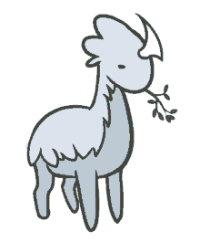

<!-- Banner -->
<p align="center">
   
</p>


<!-- Title And Intro Section -->
<h2>&nbsp;&nbsp;<a href="https://git.io/typing-svg"></a></h2>

🌌 Hello, it’s a pleasure to see you here! I’m Chris Alegría, a passionate and recently graduated Engineer in Software Development and Management from the [Technological University of San Juan del Río](https://utsjr.edu.mx/) 🎓. I love building efficient and scalable solutions — from web apps with React, Angular, and Node.js, to mobile apps with Flutter. 🪐 I’m always learning and exploring new technologies to improve my skills and deliver meaningful work 🌿. Some tools and languages I’ve worked with include HTML5, CSS3, JavaScript, TypeScript, Python, Java, C#, Kotlin, SQL, and more. I believe in the power of teamwork, clean code, and continuous growth. Let’s connect and build something amazing together! ☁️✨


<!-- Social Media Section -->
[](https://www.linkedin.com/in/christianalegriaruiz/)
[](https://open.spotify.com/user/21fdae4lll3yaxymukcfossty?si=3f5ea53b25504a81)
[](https://www.facebook.com/christian.alegriar/)
[](https://www.instagram.com/christian.alegriar?igsh=YzljYTk1ODg3Zg==)
[](https://www.threads.net/@christian.alegriar)
[](https://x.com/ChrisAlegriaR)
[](https://discordapp.com/users/922658473748070430)
[](https://steamcommunity.com/id/XGamer484/)
[](mailto:christian.alegriar@gmail.com)
<br>
<br>


<!-- Facts Section -->
<h2>🍂 Facts About Me</h2>
<ul>
  <li>🎓 I’m a recently graduated Engineer in Software Development and Management from <a href="https://www.utsjr.edu.mx/">UTSJR</a>.</li>
  <li>💖 I love <strong>programming</strong>,<strong> listen music</strong>,<strong> play video games</strong> and <strong>watch movies, series or anime.</strong></li>
  <li>🎶 My favorite bands and artist are
     <a href="https://www.rammstein.de/" target="_blank" style="text-decoration: none; color: inherit;">
       </a>,
    <a href="https://www.coldplay.com/" target="_blank" style="text-decoration: none; color: inherit;">
      </a>,
    <a href="https://www.queenonline.com/" target="_blank" style="text-decoration: none; color: inherit;">
      </a>, 
    <strong>Los Plebes del Rancho</strong> and <strong>Alfredo Olivas</strong>.
  <li>📝 I like to always learn new things and strive for perfection in what I do.</li>
  <li>🎉 My favorite videogame and anime are <strong>The Walking Dead: The Telltale Definitive Series</strong> and <strong>Kimetsu No Yaiba</strong>.  
  </li>
</ul>
<br>


<!-- Languajes, Frameworks, Environments & Tools Section -->
<h2>🚀 Languages, Frameworks, Environments and Tools I have used</h2>
<p align="left">
  <a href="https://en.wikipedia.org/wiki/HTML5">
    </a>
  <a href="https://en.wikipedia.org/wiki/CSS">
    </a>
  <a href="https://getbootstrap.com">
    </a>
  <a href="https://react.dev">
    </a>
  <a href="https://angular.dev">
    </a>
  <a href="https://dart.dev">
    </a>
  <a href="https://flutter.dev/?gclsrc=aw.ds&gad_source=1&gclid=EAIaIQobChMIqajLyaHuiwMVYCZECB1vqDzAEAAYASAAEgJjjvD_BwE">  
    </a>
  <a href="https://en.wikipedia.org/wiki/C_(programming_language)">
    </a>
  <a href="https://cpp-lang.net">
      </a>
  <a href="https://www.java.com/en/">
    </a>
  <a href="https://www.javascript.com">  
    </a>
  <a href="https://www.php.net">
    </a>
  <a href="https://nodejs.org/en">
    </a>
  <a href="https://www.python.org">
    </a>
  <a href="https://www.typescriptlang.org">
    </a>
  <a href="https://kotlinlang.org">  
    </a>
  <a href="https://www.r-project.org">
    </a>
  <a href="https://jupyter.org">  
    </a>
  <a href="https://code.visualstudio.com">  
    </a>
  <a href="https://visualstudio.microsoft.com/en/">  
    </a>
  <a href="https://developer.android.com/studio?gad_source=1&gclid=EAIaIQobChMIs5rz_JjviwMVpSVECB0BABVgEAAYASAAEgL93vD_BwE&gclsrc=aw.ds">
    </a>
  <a href="https://www.apache.org"> 
    </a>
  <a href="https://www.oracle.com/database/technologies/appdev/sql.html">
      </a>
  <a href="https://en.wikipedia.org/wiki/NoSQL">  
    </a>
  <a href="https://cassandra.apache.org/doc/4.0/cassandra/cql/">  
    </a>
  <a href="https://www.mongodb.com">  
    </a>
  <a href="https://www.mysql.com">
    </a>
  <a href="https://cassandra.apache.org/_/index.html">
    </a>
  <a href="https://www.postgresql.org">
    </a>
  <a href="https://dbeaver.io">
    </a>
  <a href="https://www.oracle.com">
    </a>
  <a href="https://www.apachefriends.org/es/index.html">
    </a>
  <a href="https://firebase.google.com">
    </a>
  <a href="https://www.apache.org">
    </a>
  <a href="https://www.latex-project.org">
    </a>
  <a href="https://es.overleaf.com">
    </a>
  <a href="https://www.virtualbox.org">
    </a>
  <a href="https://www.blender.org">
    </a>
  <a href="https://www.solidworks.com">
    </a>
  <a href="https://www.raspberrypi.com">  
    </a>
  <a href="https://www.arduino.cc">
    </a>
  <a href="https://www.netacad.com/cisco-packet-tracer">
    </a>
  <a href="https://git-scm.com">  
    </a>
  <a href="https://github.com">
    </a>
  <a href="https://miro.com/en/">
      </a>
  <a href="https://www.figma.com">
    </a>
  <a href="https://www.microsoft.com/en-us/microsoft-365/microsoft-office">
    </a>
  <a href="https://www.notion.com">
    </a>
  <a href="https://workspace.google.com/intl/es-419_mx/business/">
    </a>
</p>
<br>


<!-- GitHub Stats Section -->
<h2>📈 GitHub Stats</h2>
<p align="center">
  
  
  
</p>
<br>


<!-- Personal Stats Section -->

<h2>📊 My Monthly Stats</h2>

```text
🏃 Activities:
Programming                      █████████████░░░░░░░░░░░░  50%
Studing                          ██████░░░░░░░░░░░░░░░░░░░  30% 
Gaming                           ███░░░░░░░░░░░░░░░░░░░░░░  10%
Music                            █░░░░░░░░░░░░░░░░░░░░░░░░  5%
Visual Entertainment             █░░░░░░░░░░░░░░░░░░░░░░░░  5%
```

```text
🎸 Music:
Alternative Rock                 ████████████░░░░░░░░░░░░░  55%
Industrial Metal                 █████████░░░░░░░░░░░░░░░░  15%
Electronic                       ███░░░░░░░░░░░░░░░░░░░░░░  15%
Pop                              ███░░░░░░░░░░░░░░░░░░░░░░  10%
Regional Mexicano                ██░░░░░░░░░░░░░░░░░░░░░░░  5%
```

```text
🕹️ Gaming:
Rimworld                         ███████████████░░░░░░░░░░  60%
Amnesia: The Bunker              ████████░░░░░░░░░░░░░░░░░  30% 
Until Then                       ███░░░░░░░░░░░░░░░░░░░░░░  10%
```

```text
🎭 Visual Entertainment:
Series                           ███████████████░░░░░░░░░░  60% 
Anime                            █████░░░░░░░░░░░░░░░░░░░░  20%
Movies                           █████░░░░░░░░░░░░░░░░░░░░  20%
```

```text
💬 Languages & Frameworks:
Git                              ███████████████░░░░░░░░░░  60%
JavaScript                       █████░░░░░░░░░░░░░░░░░░░░  20%
CSS                              ███░░░░░░░░░░░░░░░░░░░░░░  10%
HTML                             ███░░░░░░░░░░░░░░░░░░░░░░  10%

🔥 Editors: 
VSC                              █████████████████████████  100%

💻 Operative Sistems: 
Windows                          █████████████████████████  100%
```
<br>


<!-- Spotify Activity Section -->
<h2>🎶 My Spotify Status and Activity</h2>
<p align="center">
  
</p>
<p align="center">
  
</p>
<br>


<!-- Dality Quotes -->
<h2>💭 Quote of the Day</h2>
<p align="center">
  <a href="https://github.com/piyushsuthar/github-readme-quotes">
    
  </a>
</p>
<p align='center'>
  
</p>


<!--- ChrisAlegria/ChrisAlegria is a ✨ special ✨ repository because its `README.md` (this file) appears on your GitHub profile.
You can click the Preview link to take a look at your changes. ---> 
